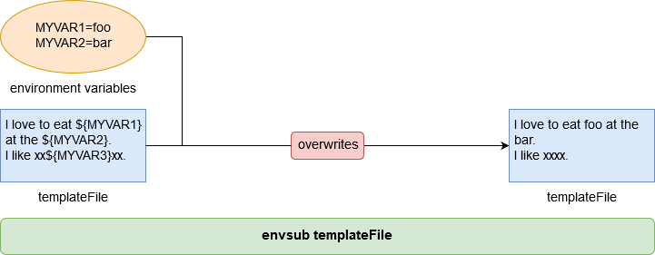
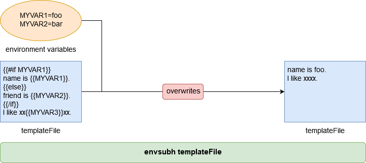
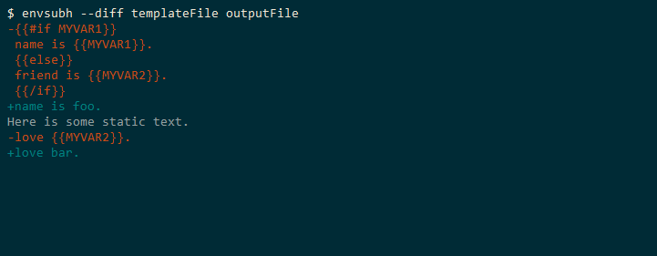

envsub is envsubst for Node.js
==============================

[](https://travis-ci.org/danday74/envsub)
[](https://coveralls.io/github/danday74/envsub?branch=master)
[](https://david-dm.org/danday74/envsub)
[](https://www.npmjs.com/package/envsub)
[](https://www.npmjs.com/package/envsub)

**envsub is envsubst for Node.js, providing file-level environment variable substitution, supporting both global CLI and local promise-based usage.**

**envsub works with any file format - e.g. HTML, JSON, text, etc.**

<br><br>


Contents
========

* **Intro**
  * [What is envsub?](#what-is-envsub)
  * [What is envsubh?](#what-is-envsubh)
* **envsub**
  * [Global CLI Usage](#envsub--global-cli-usage)
  * [Quick Reference / Help](#envsub--quick-reference--help)
  * [Docker Integration (optional)](#envsub--docker-integration-optional)
  * [Local Promise-based Usage](#envsub--local-promise-based-usage)
* **envsubh**
  * [Global CLI Usage](#envsubh--global-cli-usage)
  * [Quick Reference / Help](#envsubh--quick-reference--help)
  * [Local Promise-based Usage](#envsubh--local-promise-based-usage)

<br><br>


Intro
=====

What is envsub?
---------------

Given a template file, envsub performs **environment variable substitution** and saves the result to an output file.

envsub has **flags / options** to:
 
* restrict which environment variables are substituted and
* choose template substitution syntax - e.g. ${MYVAR} or {{MYVAR}} or etc.

What is envsubh?
----------------

envsubh is available automatically when you install envsub.

Given a template file, envsubh performs **[Handlebars](https://www.npmjs.com/package/handlebars) templating using environment variables as data** and saves the result to an output file.

[](#envsub-is-envsubst-for-nodejs)

<br><br>


envsub > Global CLI Usage
=========================

```bash
npm install -g envsub
```

examples
--------

<br>


**envsub basic usage** .. ```envsub templateFile outputFile```

> By default, all environment variables are substituted.

<br>


**envsub --env flag** .. ```envsub --env MYVAR1 --env MYVAR2=station templateFile outputFile```

> Repeatable flag to restrict which environment variables are substituted. In the example, only MYVAR1 and MYVAR2 are substituted.
>
> Optionally --env can provide an overriding value. In the example, MYVAR2 is substituted in this manner.

<br>


**envsub --protect flag** .. ```envsub --protect templateFile outputFile```

> Protect non-existent environment variable placeholders from being substituted with an empty string.
>
> In the example, MYVAR3, because it does not exist, is protected from substitution.

<br>


**envsub --syntax flag** .. ```envsub --syntax handlebars templateFile outputFile```

> The template substitution syntax, one of:
> 
> * dollar-basic ```$MYVAR```
> * dollar-curly ```${MYVAR}```
> * dollar-both ```$MYVAR and ${MYVAR}```
> * handlebars ```{{MYVAR}}```
> * default ```${MYVAR}```

<br>



**envsub overwrite** .. ```envsub templateFile```

> ```envsub templateFile``` is shorthand for ```envsub templateFile templateFile```
> 
> Here, the template file is overwritten. This seemingly destructive command is useful in the docker world.
>
> After copying a template file into a docker image, it can be useful to overwrite the copied file with its substituted equivalent.

<br>


**envsub --diff flag** .. ```envsub --diff templateFile outputFile```

> Logs the difference between the template file and the output file.

[](#envsub-is-envsubst-for-nodejs)

<br><br>


envsub > Quick Reference / Help
===============================

```bash
envsub --help
```

```text
  Usage: envsub [options] <templateFile> [outputFile]

  Options:

    -h, --help                output usage information
    -V, --version             output the version number
    -d, --diff                show diff between template file and output file
    -e, --env <name>[=value]  environment variable to substitute .. if none specified then substitute all .. this flag can be repeated
    -p, --protect             protect non-existent environment variable placeholders (that would otherwise be substituted) .. do not substitute them with an empty string
    -s, --syntax <syntax>     template substitution syntax, one of .. dollar-basic $MYVAR .. dollar-curly ${MYVAR} .. dollar-both $MYVAR and ${MYVAR} .. handlebars {{MYVAR}} .. default ${MYVAR}

  Examples:

    Typical usage
    -------------
    $ envsub templateFile outputFile
    $ envsub --diff --env MYVAR1 --env MYVAR2=foo --protect --syntax dollar-both templateFile outputFile

    Overwrite your template file
    ----------------------------
    Useful inside a docker container after you have copied your template file into the container
    $ envsub templateFile
    $ envsub -d -e MYVAR1 -e MYVAR2=foo -p -s dollar-both templateFile
```

[](#envsub-is-envsubst-for-nodejs)

<br><br>


envsub > Docker Integration (optional)
======================================

envsubst is recognised by [NGINX](https://hub.docker.com/_/nginx) as a templating solution.

This module seeks to make envsubst freely available to the Node.js community for Docker templating.

In both examples below the file ```./files/public/index.html``` is a template file.

Build time templating / env substitution
----------------------------------------

Sample build time [Dockerfile](https://github.com/danday74/envsub/tree/master/Dockerfiles/build)

```docker
docker build --build-arg MY_NAME=Daniel -t danday74/envsub-build-example .
docker run --name envbuild -d -p "8080:8080" danday74/envsub-build-example
```

Run time templating / env substitution
--------------------------------------

Sample run time [Dockerfile](https://github.com/danday74/envsub/tree/master/Dockerfiles/run)

```docker
docker build -t danday74/envsub-run-example .
docker run --name envrun1 -d -e MY_NAME=Daniel -p "8081:8080" danday74/envsub-run-example
docker run --name envrun2 -d -e MY_NAME=Jimbob -p "8082:8080" danday74/envsub-run-example
```

[](#envsub-is-envsubst-for-nodejs)

<br><br>


envsub > Local Promise-based Usage
==================================

```bash
npm install --save envsub
```

Local promise-based options are a perfect reflection of global CLI flags.

```javascript
const envsub = require('envsub');

let templateFile = `${__dirname}/templateFile`;
let outputFile = `${__dirname}/outputFile`;
let options = {
  diff: false, // see --diff flag
  envs: [
    {name: 'MYVAR1'}, // see --env flag
    {name: 'MYVAR2', value: 'boo'} // see --env flag
  ],
  protect: false, // see --protect flag
  syntax: 'default' // see --syntax flag
};

// creates or overwrites the output file
envsub({templateFile, outputFile, options}).then((envobj) => {
  console.log(envobj.templateFile);
  console.log(envobj.templateContents);
  console.log(envobj.outputFile);
  console.log(envobj.outputContents);
}).catch((err) => {
  console.error(err.message);
});
```

[](#envsub-is-envsubst-for-nodejs)

<br><br>


envsubh > Global CLI Usage
==========================

```bash
npm install -g envsub # yes, this also globally installs envsubh
```

examples
--------


**envsubh basic usage**

This command simply takes your template file and throws it at handlebars, using your environment variables as the templating data.

All Handlebars templating is valid.

For the docs refer to [Handlebars](https://www.npmjs.com/package/handlebars)



**envsubh overwrite** - see envsub for details TODO-LINK-HERE



**envsubh --diff flag** - see envsub for details TODO-LINK-HERE

[](#envsub-is-envsubst-for-nodejs)

<br><br>


envsubh > Quick Reference / Help
================================

```bash
envsubh --help
```

```text
  Usage: envsubh [options] <templateFile> [outputFile]

  Options:

    -h, --help     output usage information
    -V, --version  output the version number
    -d, --diff     show diff between template file and output file

  Examples:

    Typical usage
    -------------
    $ envsubh templateFile outputFile
    $ envsubh --diff templateFile outputFile

    Overwrite your template file
    ----------------------------
    Useful inside a docker container after you have copied your template file into the container
    $ envsubh templateFile
    $ envsubh -d templateFile
```

[](#envsub-is-envsubst-for-nodejs)

<br><br>


envsubh > Local Promise-based Usage
===================================

```bash
npm install --save envsub # yes, this is correct
```

Local promise-based options are a perfect reflection of global CLI flags.

```javascript
const envsubh = require('envsub/envsubh');

let templateFile = `${__dirname}/templateFile`;
let outputFile = `${__dirname}/outputFile`;
let options = {
  diff: false // see --diff flag
};

envsubh({templateFile, outputFile, options}).then((envobj) => {
  console.log(envobj.templateFile);
  console.log(envobj.templateContents);
  console.log(envobj.outputFile);
  console.log(envobj.outputContents);
}).catch((err) => {
  console.error(err.message);
});
```

[](#envsub-is-envsubst-for-nodejs)

<br><br>

Hope this module proves useful out there.

Now to him who is able to keep you from stumbling and to present you blameless before the presence of his glory with great joy, to the only God, our Savior, through Jesus Christ our Lord, be glory, majesty, dominion, and authority, before all time and now and forever. Amen. [Jude 24-25](https://www.biblegateway.com/passage/?search=Jude&version=ESV)
