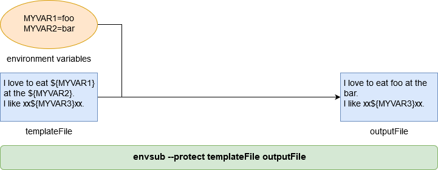
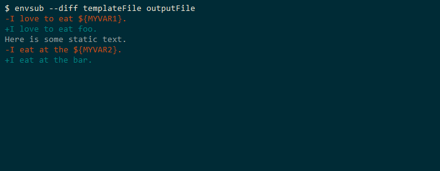
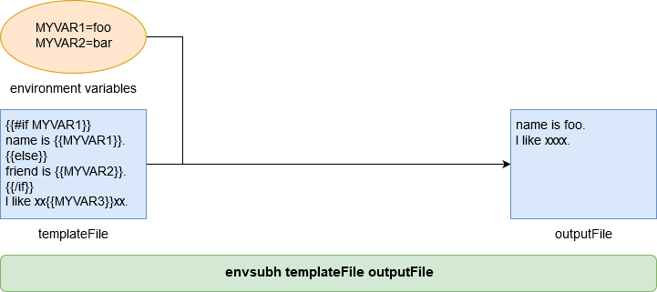

envsub is envsubst for Node.js
==============================

[](https://travis-ci.org/danday74/envsub)
[](https://coveralls.io/github/danday74/envsub?branch=master)
[](https://david-dm.org/danday74/envsub)
[](https://www.npmjs.com/package/envsub)
[](https://www.npmjs.com/package/envsub)

**envsub is envsubst for Node.js, providing file-level environment variable substitution, supporting both global CLI and local promise-based usage.**

**envsub works with any file format - e.g. HTML, JSON, text, etc.**


Contents
========

Quick Reference - envsub

* Intro
* envsub
  * Global CLI Usage
  * Quick Reference
  * Docker Integration (optional)
  * Local Promise-based Usage  
* envsubh
  * Global CLI Usage
  * Quick Reference
  * Local Promise-based Usage


envsub - Global CLI Usage
=========================

```bash
npm install -g envsub
```

Examples
--------

In the following example diagrams:

**green depicts the CLI command to execute**

orange depicts environment variables in existence

blue depicts a file and its contents


**envsub basic usage**

By default, all environment variables, including non-existent environment variable placeholders, are substituted.


**envsub --env flag**

This repeatable flag allows you to restrict which environment variables will be substituted. In the example, only MYVAR1 and MYVAR2 are being substituted.

--env can also provide an **overriding** value to substitute an environment variable placeholder with. In the example, MYVAR2 is substituted using an overriding value.



**envsub --protect flag**

Protects non-existent environment variable placeholders from being substituted. In the example, MYVAR3, because it does not exist, is protected from substitution.


**envsub --syntax flag**

The template substitution syntax, one of:
 
* dollar-basic $MYVAR
* dollar-curly ${MYVAR}
* dollar-both $MYVAR and ${MYVAR}
* handlebars {{MYVAR}}
* default ${MYVAR}


**envsub overwrite**

```envsub templateFile``` is shorthand for ```envsub templateFile templateFile```

This seemingly stupid command is useful in the docker world.

After copying a template file into a docker container, it can be useful to overwrite the template file in the container with its substituted equivalent.



**envsub --diff flag**

Logs the difference between the template file and the output file.


envsub - Quick Reference
========================

```bash
envsub --help
```

>  Usage: envsub [options] <templateFile> [outputFile]
>
>  Options:
>
>    -h, --help                output usage information
>    -V, --version             output the version number
>    -d, --diff                show diff between template file and output file
>    -e, --env <name>[=value]  environment variable to substitute .. if none specified then substitute all .. this flag can be repeated
>    -p, --protect             protect non-existent environment variable placeholders (that would otherwise be substituted) .. do not substitute them with an empty string
>    -s, --syntax <syntax>     template substitution syntax, one of .. dollar-basic $MYVAR .. dollar-curly ${MYVAR} .. dollar-both $MYVAR and ${MYVAR} .. handlebars {{MYVAR}} .. default ${MYVAR}
>
>  Examples:
>
>    Typical usage
>    -------------
>    $ envsub templateFile outputFile
>    $ envsub --diff --env MYVAR1 --env MYVAR2=foo --protect --syntax dollar-both templateFile outputFile
>
>    Overwrite your template file
>    ----------------------------
>    Useful inside a docker container after you have copied your template file into the container
>    $ envsub templateFile
>    $ envsub -d -e MYVAR1 -e MYVAR2=foo -p -s dollar-both templateFile


envsub - Docker Integration (optional)
======================================

envsubst is recognised by [NGINX](https://hub.docker.com/_/nginx) as a templating solution.

This module seeks to make envsubst freely available to the Node.js community for Docker templating.

In both examples below the file ```./files/public/index.html``` is a template file.

Build time templating / env substitution
----------------------------------------

Sample build time [Dockerfile](https://github.com/danday74/envsub/tree/master/Dockerfiles/build)

```docker
docker build --build-arg MY_NAME=Daniel -t danday74/envsub-build-example .
docker run --name envbuild -d -p "8080:8080" danday74/envsub-build-example
```

Run time templating / env substitution
--------------------------------------

Sample run time [Dockerfile](https://github.com/danday74/envsub/tree/master/Dockerfiles/run)

```docker
docker build -t danday74/envsub-run-example .
docker run --name envrun1 -d -e MY_NAME=Daniel -p "8081:8080" danday74/envsub-run-example
docker run --name envrun2 -d -e MY_NAME=Jimbob -p "8082:8080" danday74/envsub-run-example
```


envsub - Local Promise-based Usage
==================================

```bash
npm install --save envsub
```

Local promise-based options are a perfect reflection of global CLI flags.

```javascript
const envsub = require('envsub');

let templateFile = `${__dirname}/templateFile`;
let outputFile = `${__dirname}/outputFile`;
let options = {
  diff: false, // see --diff flag
  envs: [
    {name: 'MYVAR1'}, // see --env flag
    {name: 'MYVAR2', value: 'boo'} // see --env flag
  ],
  protect: false, // see --protect flag
  syntax: 'default' // see --syntax flag
};

// creates or overwrites the output file
envsub({templateFile, outputFile, options}).then((envobj) => {
  console.log(envobj.templateFile);
  console.log(envobj.templateContents);
  console.log(envobj.outputFile);
  console.log(envobj.outputContents);
}).catch((err) => {
  console.error(err.message);
});
```


envsubh - Global CLI Usage
==========================

```bash
npm install -g envsub # yes, this also globally installs envsubh
```

```bash
envsubh --help
```

Examples
--------



**envsubh basic usage**

This command simply takes your template file and throws it at handlebars, using your environment variables as the templating data.

All Handlebars templating is valid.

For the docs refer to [Handlebars](https://www.npmjs.com/package/handlebars)


**envsubh overwrite** - see envsub for details TODO-LINK-HERE


**envsubh --diff flag** - see envsub for details TODO-LINK-HERE


envsubh - Quick Reference
=========================

```bash
envsubh --help
```

  Usage: envsubh [options] <templateFile> [outputFile]

  Options:

    -h, --help     output usage information
    -V, --version  output the version number
    -d, --diff     show diff between template file and output file

  Examples:

    Typical usage
    -------------
    $ envsubh templateFile outputFile
    $ envsubh --diff templateFile outputFile

    Overwrite your template file
    ----------------------------
    Useful inside a docker container after you have copied your template file into the container
    $ envsubh templateFile
    $ envsubh -d templateFile


envsubh - Local Promise-based Usage
===================================

```bash
npm install --save envsub # yes, this is correct
```

Local promise-based options are a perfect reflection of global CLI flags.

```javascript
const envsubh = require('envsub/envsubh');

let templateFile = `${__dirname}/templateFile`;
let outputFile = `${__dirname}/outputFile`;
let options = {
  diff: false // see --diff flag
};

envsubh({templateFile, outputFile, options}).then((envobj) => {
  console.log(envobj.templateFile);
  console.log(envobj.templateContents);
  console.log(envobj.outputFile);
  console.log(envobj.outputContents);
}).catch((err) => {
  console.error(err.message);
});
```

Hope this module proves useful out there. God bless :)
